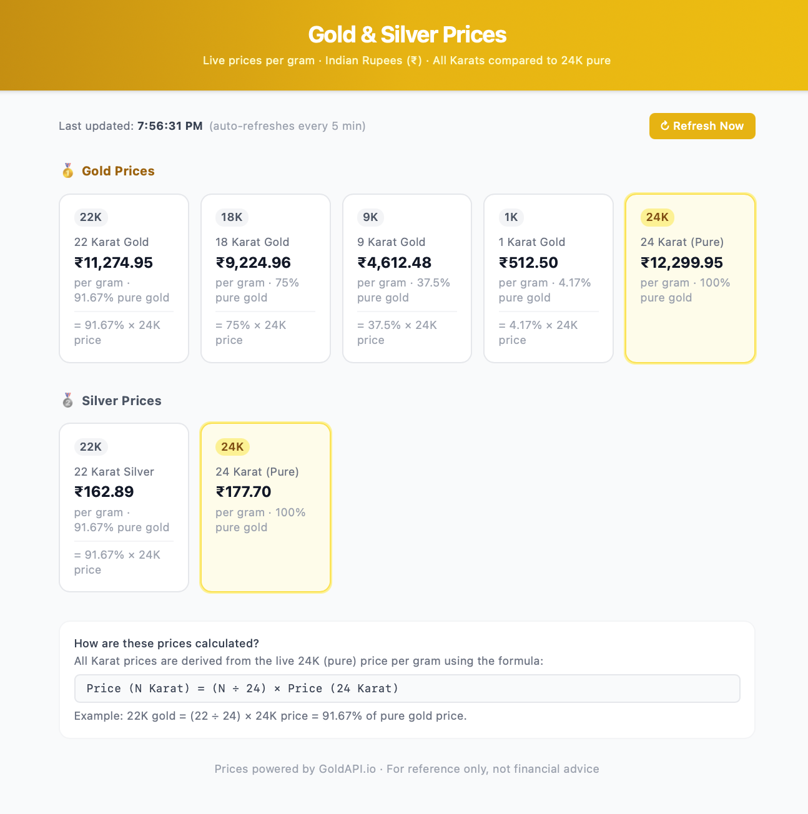

# 💰 Gold & Silver Prices

A modern and responsive web application that displays **live Gold and Silver prices per gram** in **Indian Rupees (₹)** for multiple purity levels (Karats). The application automatically refreshes prices every 5 minutes and provides an easy comparison across different karats.



---

## ✨ Features

- 📈 Live Gold & Silver prices
- 💎 Supports multiple gold purities
  - 24K (Pure)
  - 22K
  - 18K
  - 9K
  - 1K
- 🥈 Silver prices
  - 24K (Pure)
  - 22K
- 🇮🇳 Prices displayed in Indian Rupees (₹)
- 🔄 Auto refresh every 5 minutes
- 🔃 Manual "Refresh Now" button
- 📱 Fully responsive design
- 🎨 Clean card-based UI
- 🧮 Automatic karat price calculation from 24K price

---

## 📷 Preview

> Replace this image with your own project screenshot.

```
/assets/screenshot.png
```

---

## 🚀 Tech Stack

- HTML5
- CSS3
- JavaScript (ES6)
- GoldAPI (Live Metal Prices API)

---

## 📂 Project Structure

```
src/
├── components/
│   ├── Header.jsx
│   ├── LoadingSpinner.jsx
│   ├── MetalSection.jsx
│   └── PriceCard.jsx
├── hooks/
│   └── useMetalPrices.js
├── services/
│   └── goldApi.js
├── App.jsx
└── index.css

```

---

## ⚙️ Installation

Clone the repository

```bash
git clone https://github.com/your-username/gold-silver-prices.git
```

Navigate to the project folder

```bash
cd gold-silver-prices
```

Open the project

```bash
index.html
```

Or use Live Server in VS Code.

---

## 🔑 API Configuration

This project uses **GoldAPI** to fetch live gold and silver prices.

Create a configuration file or update your JavaScript with your API key:

```javascript
const API_KEY = "YOUR_API_KEY";
```

---

## 📊 Price Calculation

All karat prices are calculated from the live **24K (Pure)** price.

Formula:

```
Price (N Karat) = (N / 24) × Price (24 Karat)
```

Example:

```
22K Price = (22 / 24) × 24K Price
```

Purity Chart

| Karat | Purity |
|-------|---------|
| 24K | 100% |
| 22K | 91.67% |
| 18K | 75% |
| 9K | 37.5% |
| 1K | 4.17% |

---

## 🎨 UI Features

- Modern card layout
- Golden theme
- Responsive grid
- Price highlighting
- Auto refresh timer
- Manual refresh button
- Live update timestamp

---

## 📱 Responsive Design

The application is optimized for:

- Desktop
- Laptop
- Tablet
- Mobile devices

---

## 🔄 Auto Refresh

The application automatically updates prices every:

```
5 Minutes
```

Users can also refresh instantly using the **Refresh Now** button.

---

## 📌 Future Improvements

- Historical price charts
- Currency selector
- Dark mode
- Multiple country support
- Price alerts
- Favorite metals
- Offline caching
- Daily/Weekly trends

---

## 🤝 Contributing

Contributions are welcome!

1. Fork the repository
2. Create a new branch

```bash
git checkout -b feature-name
```

3. Commit your changes

```bash
git commit -m "Added new feature"
```

4. Push to the branch

```bash
git push origin feature-name
```

5. Open a Pull Request

---

## 📄 License

This project is licensed under the MIT License.

---

## 🙌 Acknowledgements

- GoldAPI for live precious metal prices
- Open-source community
- All contributors

---

## ⭐ Support

If you found this project helpful, consider giving it a ⭐ on GitHub.

Happy Coding! 🚀